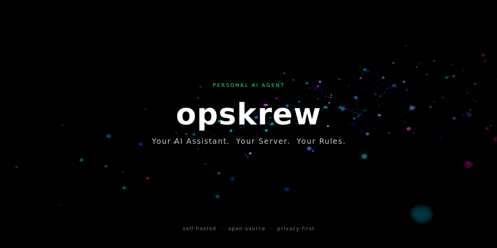

<div align="center">



## Your AI Assistant. Your Server. Your Rules.

[](LICENSE)
[](https://nodejs.org)
[](#requirements)

</div>

---

opskrew is a personal AI assistant you install on your own VPS. It connects to Telegram, Discord, or WhatsApp — whichever you already use — and runs 24/7 on a server you control. Your conversations, memories, and API keys never leave your machine.

---

## Requirements

- **VPS running Ubuntu 22.04 or newer**
  - Any provider works: [Hostinger](https://hostinger.com) (affordable, good entry point), DigitalOcean, Hetzner, Linode, Vultr, etc.
  - A $4–6/month plan is enough to get started
- **Node.js 22+** — installed automatically by the installer
- **API key from at least one [supported AI provider](#ai-providers)**

> opskrew is designed for Ubuntu VPS deployments. It does not support Mac, Windows, or Docker.

---

## Quick Start ⚡

**Step 1 — Get a VPS**

Spin up an Ubuntu 22.04+ server. You just need SSH access and a root or sudo user.

**Step 2 — Run the installer**

```bash
curl -fsSL https://raw.githubusercontent.com/rankgnar/opskrew/main/scripts/install.sh | bash
```

This installs Node.js 22, PM2, and the `opskrew` CLI.

**Step 3 — Run the setup wizard**

```bash
opskrew setup
```

The interactive wizard walks you through every option using keyboard selectors — no free-text fields for things like language or personality. Configure your AI provider, channels, assistant name, tone, and security settings. When done:

```bash
opskrew start
```

Open your messaging app and start talking.

---

## Features

### 🤖 AI Providers — 9 supported

- Anthropic (Claude Sonnet, Haiku, Opus)
- OpenAI (GPT-4o, o3, o4-mini)
- DeepSeek (V3, R1)
- Google Gemini (2.5 Flash, 2.5 Pro)
- OpenRouter (access most major models with one key)
- Mistral AI (Large, Small)
- xAI (Grok 3, Grok 3 Mini)
- Groq (Llama 3.3, Mixtral — ultra-fast inference)
- Custom endpoint (any OpenAI-compatible API: Ollama, vLLM, LM Studio)

### 💬 Channels — 3 supported

- **Telegram** — text, voice, images, documents
- **Discord** — text, images, documents, long message auto-split
- **WhatsApp** — QR auth, auto-reconnect, phone allowlist

### 🧠 Memory & Context

- **First-interaction onboarding** — on your very first message, the bot asks a few questions to learn about you. That context shapes every future conversation.
- **Persistent memory** — the assistant remembers facts across conversations using `[MEMORY:…]` tags, stored in SQLite
- **Auto-summary** — at 40 messages, conversation history is summarized automatically to keep context fresh

### 🔍 Search & Documents

- **Web search** — powered by DuckDuckGo, no API key required
- **Vision** — analyze images sent through any channel
- **Document reading** — attach `.txt`, `.md`, `.json`, `.csv`, `.py`, `.js`, `.ts`, `.html`, `.pdf` and the AI reads them

### 🗂️ Knowledge Base

Load your own documents into `~/.opskrew/knowledge/` and they'll be injected into every conversation automatically. Manage them via CLI or dashboard.

### ⏰ Reminders

Set reminders in natural language. They're stored in SQLite and delivered as push notifications through your messaging channel.

### 🎭 Personalities — 6 modes

Switch the assistant's tone at any time:

- `default`, `professional`, `casual`, `creative`, `concise`, `teacher`

Switch via `/mode <name>` in chat or from the dashboard.

### 📊 Usage Tracking

- Token counts per conversation
- Cost estimation by provider and model
- 7-day usage chart in the dashboard

### 📧 Email Integration

Read, search, and send emails through your existing email account. Works with Gmail, Outlook, Yahoo, Fastmail, and any IMAP/SMTP provider. App password support for Gmail 2FA. See [docs/email.md](docs/email.md).

### 📅 Calendar Integration

View today's events, your week schedule, create events, and search upcoming events via Google Calendar service account. See [docs/calendar.md](docs/calendar.md).

### 🐙 GitHub Integration

List repositories, view issues and pull requests, create issues, and check notifications using a Personal Access Token. See [docs/github.md](docs/github.md).

### 🛡️ Security Hardening

AES-256-GCM encrypted vault, token detection before LLM calls, skill scanner, localhost-only dashboard, and optional UFW + fail2ban server hardening via setup wizard. See [docs/security.md](docs/security.md).

### 🔄 Resilience

Auto-retry on AI provider failures, PM2 crash recovery with automatic restart, WhatsApp auto-reconnect, and SQLite WAL mode for crash-safe database writes.

### 🧩 Skills System

Skills extend the assistant with specialized instructions that activate only when a trigger keyword is detected — no token waste when idle.

Skills use the **AgentSkills** `.md` format (YAML frontmatter + Markdown body), compatible with OpenClaw, Cursor, and Claude Code.

Built-in skills include: coding helper, translator, email writer, summarizer, creative writer.

You can write your own or install from a file or URL. Every skill is scanned before installation for prompt injection, RCE patterns, and data exfiltration. See [docs/skills.md](docs/skills.md).

### 👥 Team Agents

Delegate tasks to specialized sub-agents, each with its own system prompt, skills, and isolated history:

- **researcher** — web search, URL reading, fact-finding
- **coder** — focused on programming tasks
- **writer** — articles, drafts, long-form content

Delegation is automatic based on trigger patterns, or you can call an agent directly with `/ask <id> <message>`. See [docs/team.md](docs/team.md).

### 🖥️ Web Dashboard

A dark glassmorphism interface for managing everything without touching the CLI.

- Bound to `127.0.0.1:3000` — never exposed to the internet
- Access via SSH tunnel:

```bash
ssh -L 3000:127.0.0.1:3000 user@your-vps
# then open http://localhost:3000
```

Dashboard sections: Conversations, Memories, Reminders, Usage, Knowledge Base, Skills, Team, Settings.

### 🔄 Auto-Update

opskrew checks for updates every hour, rebuilds, and restarts automatically via PM2. You can opt out during setup or toggle it in settings.

### 🔒 Server Security Hardening

The setup wizard can configure your server with:

- UFW firewall (only SSH + necessary ports)
- fail2ban (brute-force protection)
- Swap file (stability on low-memory VPS)

---

## Integrations

opskrew supports first-class integrations with external services, all configured via the setup wizard and stored securely in the encrypted vault.

| Integration | What it does | Setup |
|---|---|---|
| **Email** | Read, search, and send email via IMAP/SMTP | `opskrew setup --section email` · [docs](docs/email.md) |
| **Google Calendar** | View and create calendar events | Place service account JSON · [docs](docs/calendar.md) |
| **GitHub** | Repos, issues, PRs, notifications | `opskrew setup --section github` · [docs](docs/github.md) |

---

## Documentation

- [Email integration](docs/email.md) — Gmail, Outlook, IMAP/SMTP setup and commands
- [Calendar integration](docs/calendar.md) — Google Calendar service account setup
- [GitHub integration](docs/github.md) — Personal access token and available commands
- [Security](docs/security.md) — Vault encryption, token detection, skill scanner, server hardening
- [Skills](docs/skills.md) — AgentSkills format, creating custom skills, scanner
- [Team agents](docs/team.md) — Built-in agents, custom agents, delegation
- [Dashboard](docs/dashboard.md) — SSH tunnel access, all dashboard sections

---

## Setup Wizard

Run `opskrew setup` for a fully interactive configuration experience. All options use keyboard selectors — arrow keys, space to toggle, enter to confirm. No free-text prompts for things like language choice or personality mode.

Sections you'll configure:

- AI provider and model
- API key / authentication
- Assistant name and personality
- Channel (Telegram / Discord / WhatsApp) and credentials
- Feature toggles (memory, search, vision, team, skills, etc.)
- Server security hardening

Reconfigure any single section later:

```bash
opskrew setup --section auth
opskrew setup --section channels
opskrew setup --section security
```

---

## Dashboard

The web dashboard gives you a full management interface without the terminal.

<p align="center">
  
  <br>
  
</p>

Access it via SSH tunnel (the dashboard is bound to `127.0.0.1` — it is never reachable from the internet):

```bash
ssh -L 3000:127.0.0.1:3000 user@your-vps
```

Then open <http://localhost:3000> in your browser.

What you can do from the dashboard:

- Browse and delete conversation history
- Add, edit, and delete memories
- Create and manage reminders (with datetime picker)
- View usage stats and token cost estimation
- Upload and remove knowledge base files
- Create, edit, enable/disable, and install skills (with security scan)
- Create team agents, assign skills, and view their history
- Change any setting without touching config files
- One-click Update and Restart buttons in the sidebar

See [docs/dashboard.md](docs/dashboard.md) for full details.

---

## CLI Commands

- `opskrew setup` — Run the interactive setup wizard
- `opskrew setup --section <name>` — Reconfigure one section: `auth`, `personality`, `channels`, `security`, `features`
- `opskrew start` — Start the assistant (runs via PM2)
- `opskrew stop` — Stop the assistant
- `opskrew status` — Show current runtime status
- `opskrew logs` — Stream recent logs
- `opskrew knowledge add <file>` — Add a document to the knowledge base
- `opskrew knowledge list` — List knowledge base files
- `opskrew knowledge remove <name>` — Remove a document
- `opskrew skills list` — List all installed skills
- `opskrew skills add <file|url>` — Install a skill (auto-scanned)
- `opskrew skills enable <id>` — Enable a skill
- `opskrew skills disable <id>` — Disable a skill
- `opskrew skills remove <id>` — Remove a skill
- `opskrew team list` — List all team agents
- `opskrew team create` — Interactive agent creator
- `opskrew team remove <id>` — Remove a team agent

---

## Telegram / Discord Commands

- `/memory` — List stored memories
- `/forget <id>` — Delete a memory by ID
- `/mode` — Show current personality and available options
- `/mode <name>` — Switch personality (`default`, `professional`, `casual`, `creative`, `concise`, `teacher`)
- `/usage` — Show token usage and estimated cost
- `/skills` — List installed skills with enabled/disabled status
- `/skill <id>` — Toggle a skill on or off
- `/team` — List available team agents
- `/ask <id> <message>` — Send a message directly to a specific team agent
- `/remind <text>` — Create a reminder
- `/reminders` — List pending reminders

---

## Architecture

opskrew is a single Node.js process managed by PM2. Everything runs on your VPS.

```
Channels (Telegram / Discord / WhatsApp / Web)
           │
     opskrew core
   ┌────────────────────────────┐
   │  Skills Engine             │
   │  Team System               │
   │  Features (search, vision, │
   │   reminders, documents)    │
   └────────────────────────────┘
           │
   AI Providers (9)
   Anthropic · OpenAI · DeepSeek · Gemini
   OpenRouter · Mistral · xAI · Groq · Custom
           │
   Storage
   SQLite — conversations, memories, reminders, usage
   ~/.opskrew/knowledge/   — knowledge base files
   ~/.opskrew/skills/      — skill .md files
   ~/.opskrew/vault.enc    — AES-256-GCM encrypted secrets
```

- **Runtime:** Node.js 22+ managed by PM2
- **Database:** SQLite in WAL mode
- **Secrets:** AES-256-GCM encrypted vault — plain-text tokens are never written to disk

---

## Security

- **Dashboard bound to localhost** — `127.0.0.1:3000` only. Never reachable from the internet without an SSH tunnel.
- **Encrypted vault** — all API keys and tokens are stored in `~/.opskrew/vault.enc` using AES-256-GCM. Nothing sensitive is written in plain text.
- **UFW + fail2ban** — the setup wizard can harden your server: close unnecessary ports and protect against brute-force login attempts.
- **WhatsApp allowlist** — restrict bot access to specific phone numbers only.
- **Skill scanner** — every skill (local or from URL) is scanned before installation for prompt injection, obfuscated code, remote code execution patterns, and data exfiltration attempts.

---

## License

MIT — see [LICENSE](LICENSE).
