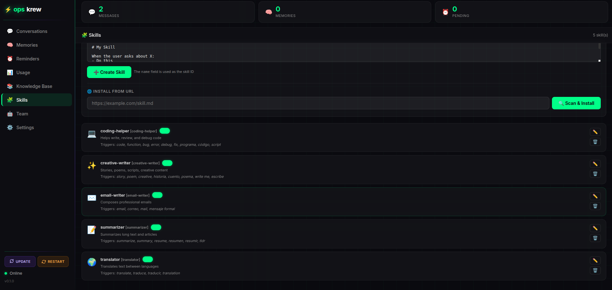
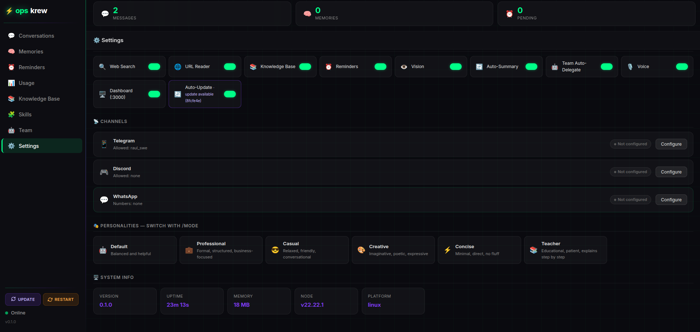

# Dashboard

The opskrew web dashboard is a dark glassmorphism interface for managing every aspect of your assistant without touching the terminal. It runs locally on your VPS and is accessible only through an SSH tunnel.

---

## Accessing the dashboard

The dashboard listens on `127.0.0.1:3000` — it is never exposed to the public internet.

**Open an SSH tunnel from your local machine:**

```bash
ssh -L 3000:127.0.0.1:3000 user@your-vps-ip
```

Keep this terminal open (or run it in the background with `-fN`):

```bash
ssh -fN -L 3000:127.0.0.1:3000 user@your-vps-ip
```

Then open your browser and go to:

```
http://localhost:3000
```

No username or password is required — authentication happens via SSH.

---

## Screenshots

<p align="center">
  
  <br>
  <em>Skills management panel</em>
</p>

<p align="center">
  
  <br>
  <em>Settings panel</em>
</p>

---

## Sections

### Conversations

Browse the full conversation history stored in SQLite. Filter by date or search for specific messages. Delete individual conversations or clear history entirely.

### Memories

View, add, edit, and delete memories — the persistent facts your assistant remembers across conversations. Each memory is stored with an ID so you can reference or remove it via `/forget <id>`.

### Reminders

Create, view, and delete reminders. Includes a datetime picker for scheduling. Pending reminders are delivered as push messages through your active channel when they fire.

### Usage

Token usage statistics per conversation:
- Input and output token counts
- Cost estimation by provider and model
- 7-day usage chart

### Knowledge Base

Upload and manage documents that are automatically injected into every conversation:
- Upload `.txt`, `.md`, `.json`, `.csv`, `.py`, `.js`, `.ts`, `.html`, `.pdf` files
- View file names, sizes, and dates
- Remove files you no longer need

Files are stored in `~/.opskrew/knowledge/`.

### Skills

Full skill management:
- View all installed skills with their trigger keywords and enabled status
- Toggle skills on or off with a single click
- Edit skill content directly in the dashboard's built-in editor
- Install new skills by pasting content or providing a URL
- Delete skills

Every skill installed through the dashboard is security-scanned before saving.

<p align="center">
  
</p>

### Team

Manage your team agents:
- View all agents with their descriptions and enabled status
- Create new agents through a form interface
- Edit agent system prompts, trigger patterns, and skill assignments
- Enable or disable individual agents
- View conversation history for each agent separately
- Delete agents

### Settings

Change any configuration setting without touching config files or restarting:

- AI provider and model selection
- Assistant name and personality mode
- Feature toggles (memory, web search, vision, skills, team, etc.)
- Update and Restart buttons in the sidebar

<p align="center">
  
</p>

---

## Sidebar actions

The dashboard sidebar includes two action buttons available from any section:

- **Update** — pulls the latest opskrew release, rebuilds, and restarts via PM2
- **Restart** — restarts the opskrew process via PM2 (useful after config changes)

---

## Tips

- Keep the SSH tunnel open in a dedicated terminal tab while using the dashboard
- Use the dashboard for bulk operations (managing many skills or memories) rather than individual chat commands
- The Settings panel is the fastest way to change your AI model or toggle features without rerunning `opskrew setup`
